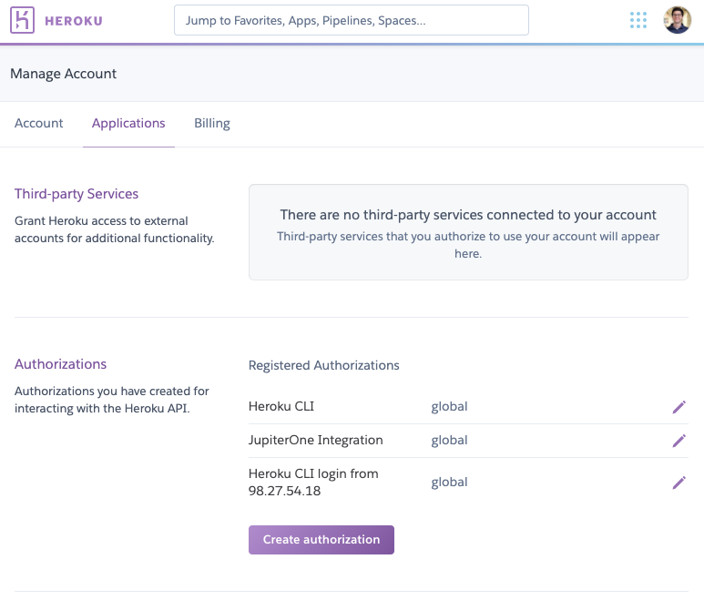
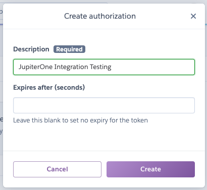

# Development

This integration uses the
[Heroku Platform API](https://devcenter.heroku.com/articles/platform-api-reference).
The root of its entity and relationship ingestion begins with a
[Heroku Enterprise Account](https://devcenter.heroku.com/categories/enterprise-accounts) -
therefore, this integration currently offers no functionality for personal or
professional accounts.

## Prerequisites

Aside from what is documented in the [README](../README.md), no special tooling
is required to run and test this integration.

## Provider account setup

To setup a Heroku account for development, please take the following steps:

1. Visit the [Heroku](https://signup.heroku.com/) sign-up page.
1. Fill out the free account sign-up form then click `Create Free Account`.
1. Follow the account verification steps to finish your account set-up.

As noted above, the root of data ingestion begins with a Heroku Enterprise
Account. Developers will not receive a response from the `/enterprise-accounts`
endpoint, but will be able to test other endpoints, such as `/teams`, `/apps`,
etc.

## Authentication

Once you've created your account, you'll need to generate an API Key to access
the Heroku API.

1. Visit <https://dashboard.heroku.com/account/applications> and click
   `Create authorization`.
   

1. Add a `Description` and an optional `Expires after (seconds)` value , then
   click `Create`.
   

1. Copy your API key into a `.env` file at the root of this project. The file's
   contents should appear as below:

   ```bash
   API_KEY=<your-api-key>
   ```

The API always requires two headers to be set - `Authorization`, using your
specific `API_KEY`, and `Accept`, with the value
`application/vnd.heroku+json; version=3`. More information is available in the
[Heroku API Overview](https://devcenter.heroku.com/articles/platform-api-reference#overview)

Example API request:

```bash
curl https://api.heroku.com/<resource> \
-H "Accept: application/vnd.heroku+json; version=3" \
-H "Authorization: Bearer <your-api-key>"
```
